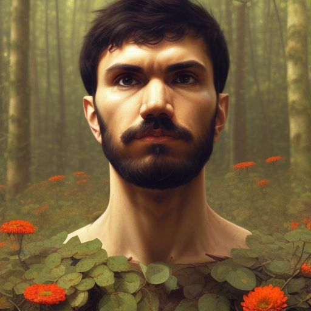
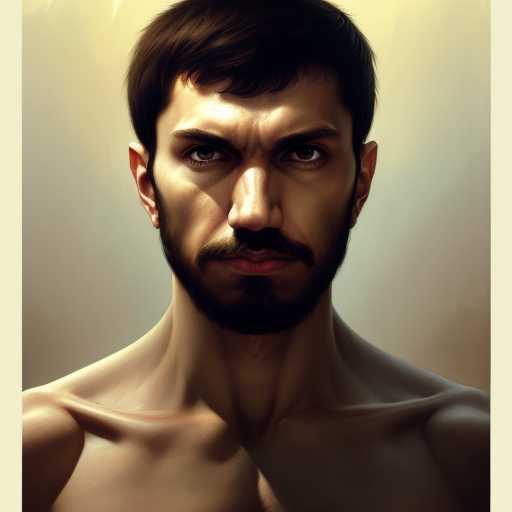
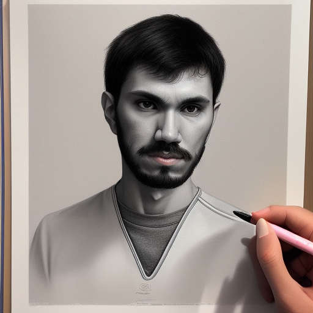

# Dreambooth with Stable diffusion

🖼 Dreambooth example using my photos based on the [dotCSV video tutorial](https://www.youtube.com/watch?v=rgKBjRLvjLs).

## 📄 Usage

1. Generate a dataset like the one found in `data/input` with around 20 images with the following typology (this dataset must contain square images of `512x512` pixels):
    ```text
    60% of foreground images of you
    30% of half body images of you
    10% of full body images of you
    ```

2. Access the [Google Colab notebook](https://colab.research.google.com/drive/1-HIbslQd7Ei_mAt25ipqSUMvbe3POm98?usp=sharing) and follow the instructions for training your model (you can find a copy under [`docs/fast_dreambooth__dotCSV__version.ipynb`](docs/fast_dreambooth__dotCSV__version.ipynb) file).

3. Once the model is trained, download the generated weights from your Google Drive since you will use them locally.

4. Using the amazing UI that [AbdBarho](https://github.com/AbdBarho) put together [here](https://github.com/AbdBarho/stable-diffusion-webui-docker), you can run the model locally and generate your own images.
   
   4.1. Clone the repo.
   ```bash
   git clone git@github.com:AbdBarho/stable-diffusion-webui-docker.git
   ```
   
   4.2. Download all needed dependencies:
   ```bash
   docker compose --profile download up --build
   ```
   
   4.3. Copy your weights under the `data` folder along with the rest of models. 

   4.4. Run the UI:
   ```bash
   docker compose --profile hlky up -d --build
   ```

   4.5. Will start the app on [`http://localhost:7860/`](http://localhost:7860/).

5. Enjoy! 🎉

## 🚂 Training details

For the training, I used the default parameters from the [dotCSV video tutorial](https://www.youtube.com/watch?v=rgKBjRLvjLs), which are the following:

```text
Training_Subject: Character
With_Prior_Preservation: Yes
Captionned_Instance_Images: False
Subject_Type: person
Instance_Name: suaresito
Number_Of_Subject_Images: 500
Dataset: person_ddim
fp16: True
Training_Steps: 1600
Seed: 75576
```

## ☑️ Results

Here are some of the results I got from the model with the used `prompt` and `cfg_scale`:

<p align="center">
   
</p>
<p align="center"><i>
   Highly detailed portrait of suaresito, stephen bliss, unreal engine, fantasy art by greg rutkowski, loish, rhads, ferdinand knab, makoto shinkai and lois van baarle, ilya kuvshinov, rossdraws, tom bagshaw, alphonse mucha, global illumination, radiant light, detailed and intricate environment
</i></p>
<p align="center"><b>CFG scale</b>: 7</p>

<p align="center">
   
</p>
<p align="center"><i>
   suaresito god of the forest, 3 0 years old, rugged, male, gorgeous, detailed face, ottoman, amazing, thighs, flowers, muscular, intricate, highly detailed, digital painting, artstation, concept art, sharp focus, illustration, art by greg rutkowski and alphonse mucha
</i></p>
<p align="center"><b>CFG scale</b>: 10</p>

<p align="center">
   
</p>
<p align="center"><i>
   Portrait of suaresito, scarred! D&D, muscular, fantasy, intricate, elegant, highly detailed, digital painting, artstation, concept art, smooth, sharp focus, illustration, art by artgerm and greg rutkowski and alphonse mucha
</i></p>
<p align="center"><b>CFG scale</b>: 13</p>

<p align="center">
   
</p>
<p align="center"><i>
   amazing lifelike award winning pencil illustration of suaresito 90210 trending on art station artgerm Greg rutkowski alphonse mucha cinematic
</i></p>
<p align="center"><b>CFG scale</b>: 7</p>
